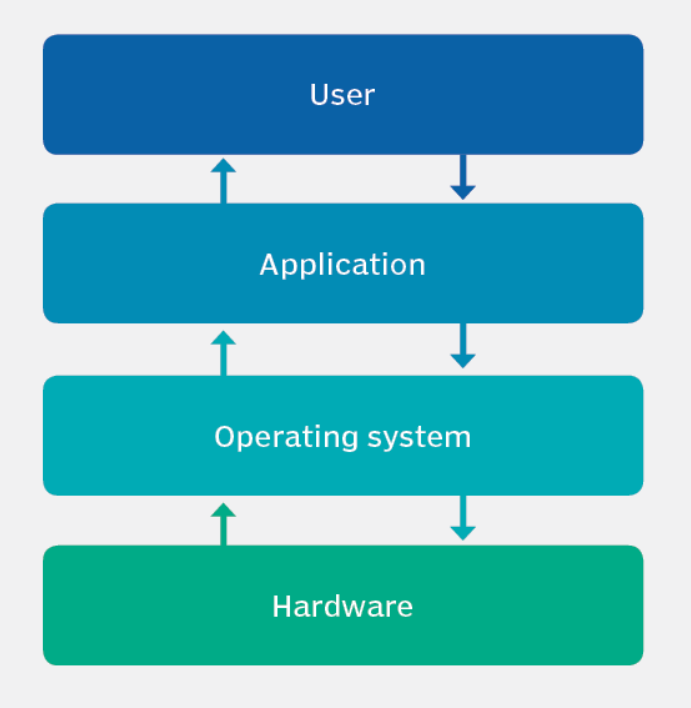
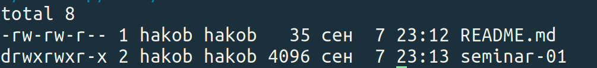
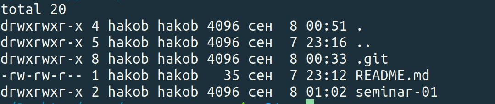

# Introduction:  Linux, terminal, Bash, C

Linux is a family of open-source Unix-like operating systems based on the Linux kernel.

You can get acquainted with Linux kernel's source code here:
[Linux kernel](https://github.com/torvalds/linux)

<table width=100%> <tr>
    <th width=70%> Linux itself is not an operating system. It is the lowest layer of the operating system, and it provides basic hardware services. Linux operating systems are called Linux distributions. They are mostly installed on server computers. They are not popular among PC users. Note, that most of professional programmers and software-engineers are using linux. So it is must-have if you are interested in IT.
    </th> <th>  </th>
 </table>

After completing caos course, you can surely add Linux to your CV.

You can read more in Russian in [Yakovlev's reading](https://github.com/victor-yacovlev/fpmi-caos/blob/master/practice/linux_basics/intro.md)

##  Terminal, common commands

---
    folder == directory == catalog

`pwd` __-__ Print current directory

`cd`  __-__ Change the current directory:

`mkdir` __-__ Create a new directory

`touch` __-__ Create a new file

`cp` __-__ Copy file/directory

`mv` __-__ Move file/directory or rename

`rm` __-__ Delete file, `rm -r` __-__ Delete directory recursively

`ls` __-__ List files and catalogs in а directory

<!-- *Options*

    ls -l

 

-----
    ls -a

 

------
    ls -la

  -->

--------------------------------------

`cat` __-__ Print the contents of a file

`head` __-__ Print the first 10 lines of a file, `head -n $count$` for fixed lines count

`tail` __-__ Print the last 10 lines of a file, `tail -n $count$` for fixed lines count

`>` __-__ Redirecting output to a file, **the file will be overwritten**

`>>` __-__ Redirecting output to a file, **the output will be added to the existing content**

`chmod` __-__ Change the permissions of a file or directory, `chmod +x`, `chmod -r`

`nano` __-__ An interactive file editor, `nano search.py`

`find` __-__ Searches files and directories, `find [where to start searching] [options] [what to find]`

`grep` __-__ Search for a string in groups of files.

`sed` __-__ Edit streams, can perform many functions such as search, replace, delete, insert

`ping` __-__ Check to see if a server is alive

###  BASH
-------------------------

Bash script starts with line `#!/bin/bash` which tells OS to invoke the specified shell to execute the commands that follow in the script. The usual extension fo bash scrip is `.sh`, since many bash scripts don't have a file extension, any executable "plaintext" file that contains the text `#!/bin/bash` within the first line of the file will also be interpreted as a bash script.

_**Basic syntax and examples**_

- Hello world on BASH
-----------------------

    #! /bin/bash

    echo "Hello world"

- Variables, if, elif, else construction
------------------

    #! /bin/bash

    variable=-1
    echo $variable
    if (($variable > 0))
    then
        echo "Positive"
    elif (($variable < 0 && $variable > -2))
    then
        echo "In interval (-2, 0)"
    else
        echo "Less than -2"
    fi

    path=/usr/share/man
    if [ -e $path ]
    then
        echo "Path $path exists"
    fi

- You can execute bash script with arguments: `./run.sh arg1 arg2`. In script itself, command line arguments can be accessed via `$1`, `$2`.
- 1Dimensional array, for and while constructions
-----------------------------------------------
    #! /bin/bash

    sum=0
    for ((i=0; i <= 10; i++))
    do
        sum=$(($i + $sum))
    done

    echo $sum

    array=("cat" "dog" "mouse" "hamster" "horse" "goldfish")
    i=0
    while [ ! ${array[$i]} = "goldfish" ]
    do
        echo "array[$i] == ${array[$i]}"
        i=$(($i + 1))
    done

    primes=(2 3 5 7 11 13 17 19 23)
    for p in ${primes[@]}
    do
        echo "$p"
    done

- 2Dimensional array
- ---------------------------------------

    #! /bin/bash

    declare -A matrix

    n=2
    for ((i=0; i < $n; i++))
    do
        for ((j=0; j < $n; ++j))
        do
            read num
            matrix[$i, $j]=$num
        done
    done

    for ((i=0; i < $n; i++))
    do
        for ((j=0; j < $n; ++j))
        do
            echo -n "${matrix[$i, $j]} "
        done
    echo ""
    done

- Functions
-------------------------------------------

    #! /bin/bash

    function calc_remains_fast() {
        echo $(($1 - $(($(($1 / $2)) * $2))))
    }

    function calc_remains_slow() {
        local n=$1
        local m=$2
        local r=0
        while (($n > 0))
        do
            if (($n < $m))
            then
                r=$n
                break
            else
                n=$(($n - $m))
            fi
        done
        echo $r
    }

    remains_fast=$(calc_remains_fast 21 5)
    echo $remains_fast
    remains_slow=$(calc_remains_slow 117 9)
    echo $remains_slow

